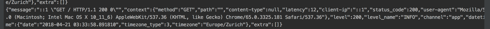

# Uniplaces Request Logger Bundle

[](https://styleci.io/repos/129761376)

This project is a symfony bundle that can be added to other projects to log api requests.
It logs request information like method, uri, latency.

This is an example of a log:



### Packagist

https://packagist.org/packages/uniplaces/request-logger-bundle

### How to use it in your project

Add the bundle to your project dependencies:
```bash
composer require uniplaces/request-logger-bundle
```

Then, make sure the RequestLoggerBundle was added to your project's bundles.

If your project has a bundles.php file with an array of vendor bundles, add the RequestLoggerBundle there:
```text
Uniplaces\RequestLoggerBundle\UniplacesRequestLoggerBundle::class => ['all' => true]
```

### Log data

* method
* path
* content-type
* latency
* client-ip
* status_code
* user-agent
